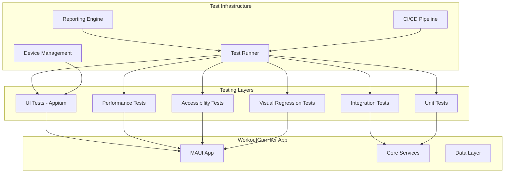

# Design Document

## Overview

The comprehensive testing apparatus for WorkoutGamifier will be a multi-layered testing framework that provides automated UI testing, enhanced unit/integration testing, performance monitoring, accessibility validation, and continuous integration support. The design leverages the existing .NET MAUI architecture and extends it with Appium-based UI automation, advanced testing utilities, and comprehensive reporting capabilities.

## Architecture

### High-Level Architecture



### Testing Framework Stack

- **UI Testing**: Appium WebDriver with .NET bindings
- **Unit/Integration Testing**: xUnit with Moq (existing)
- **Performance Testing**: NBomber + custom MAUI performance counters
- **Accessibility Testing**: Appium accessibility APIs + custom validators
- **Visual Testing**: Appium screenshot comparison with ImageSharp
- **CI/CD**: GitHub Actions with Android emulator support
- **Reporting**: Custom HTML reports with Allure integration

## Components and Interfaces

### 1. UI Test Framework

#### AppiumTestBase
```csharp
public abstract class AppiumTestBase : IDisposable
{
    protected AndroidDriver Driver { get; private set; }
    protected TestConfiguration Config { get; private set; }
    protected ScreenshotManager Screenshots { get; private set; }
    
    public virtual async Task InitializeAsync();
    public virtual async Task CleanupAsync();
    protected async Task<bool> WaitForElement(By locator, int timeoutSeconds = 10);
    protected async Task TakeScreenshot(string testName, string stepName);
}
```

#### Page Object Models
```csharp
public class SessionsPageObject : PageObjectBase
{
    public By StartSessionButton => By.Id("StartSessionButton");
    public By SessionsList => By.Id("SessionsList");
    
    public async Task<bool> StartNewSession(string sessionName);
    public async Task<List<string>> GetActiveSessions();
}
```

#### Test Scenarios
- **Critical User Workflows**: Session creation, workout completion, pool management
- **Navigation Testing**: Tab navigation, back button, deep linking
- **Data Persistence**: Create data, restart app, verify data exists
- **Error Handling**: Network failures, invalid inputs, edge cases

### 2. Enhanced Unit/Integration Testing

#### TestDataBuilder
```csharp
public class TestDataBuilder
{
    public static WorkoutBuilder Workout() => new WorkoutBuilder();
    public static SessionBuilder Session() => new SessionBuilder();
    public static WorkoutPoolBuilder Pool() => new WorkoutPoolBuilder();
    
    public class WorkoutBuilder
    {
        public WorkoutBuilder WithName(string name);
        public WorkoutBuilder WithDifficulty(DifficultyLevel level);
        public Workout Build();
    }
}
```

#### DatabaseTestFixture
```csharp
public class DatabaseTestFixture : IDisposable
{
    public TestDbContext CreateContext();
    public async Task SeedTestData();
    public async Task CleanDatabase();
    public async Task<T> ExecuteInTransaction<T>(Func<TestDbContext, Task<T>> operation);
}
```

### 3. Performance Testing Framework

#### PerformanceTestRunner
```csharp
public class PerformanceTestRunner
{
    public async Task<PerformanceResult> MeasureAppStartup();
    public async Task<PerformanceResult> MeasurePageNavigation(string fromPage, string toPage);
    public async Task<PerformanceResult> MeasureDatabaseOperation(Func<Task> operation);
    public async Task<PerformanceResult> MeasureMemoryUsage(TimeSpan duration);
}
```

#### Performance Benchmarks
- **App Startup**: < 3 seconds on mid-range devices
- **Page Navigation**: < 500ms between pages
- **Database Operations**: < 100ms for CRUD operations
- **Memory Usage**: < 150MB steady state

### 4. Accessibility Testing

#### AccessibilityValidator
```csharp
public class AccessibilityValidator
{
    public async Task<AccessibilityResult> ValidateScreen(string screenName);
    public async Task<AccessibilityResult> ValidateElement(IWebElement element);
    public async Task<AccessibilityResult> ValidateColorContrast();
    public async Task<AccessibilityResult> ValidateKeyboardNavigation();
}
```

#### Accessibility Checks
- **Semantic Labels**: All interactive elements have proper labels
- **Color Contrast**: Minimum 4.5:1 ratio for normal text
- **Touch Targets**: Minimum 44x44 points for interactive elements
- **Screen Reader**: All content accessible via screen reader

### 5. Visual Regression Testing

#### VisualTestManager
```csharp
public class VisualTestManager
{
    public async Task<VisualComparisonResult> CompareScreen(string screenName, string baselineImage);
    public async Task UpdateBaseline(string screenName, byte[] newImage);
    public async Task<byte[]> CaptureScreen(string screenName);
    public VisualComparisonResult CompareImages(byte[] baseline, byte[] current, double threshold = 0.95);
}
```

### 6. Test Infrastructure

#### TestConfiguration
```csharp
public class TestConfiguration
{
    public string AppPath { get; set; }
    public string DeviceId { get; set; }
    public string PlatformVersion { get; set; }
    public TimeSpan DefaultTimeout { get; set; }
    public bool TakeScreenshotsOnFailure { get; set; }
    public string ReportOutputPath { get; set; }
}
```

#### DeviceManager
```csharp
public class DeviceManager
{
    public async Task<List<Device>> GetAvailableDevices();
    public async Task<Device> StartEmulator(string avdName);
    public async Task InstallApp(string deviceId, string appPath);
    public async Task UninstallApp(string deviceId, string packageName);
    public async Task ClearAppData(string deviceId, string packageName);
}
```

## Data Models

### Test Result Models
```csharp
public class TestResult
{
    public string TestName { get; set; }
    public TestStatus Status { get; set; }
    public TimeSpan Duration { get; set; }
    public string ErrorMessage { get; set; }
    public List<string> Screenshots { get; set; }
    public Dictionary<string, object> Metadata { get; set; }
}

public class PerformanceResult
{
    public string OperationName { get; set; }
    public TimeSpan Duration { get; set; }
    public long MemoryUsed { get; set; }
    public double CpuUsage { get; set; }
    public bool PassedBenchmark { get; set; }
}

public class AccessibilityResult
{
    public List<AccessibilityViolation> Violations { get; set; }
    public AccessibilityScore Score { get; set; }
    public List<string> Recommendations { get; set; }
}
```

### Test Configuration Models
```csharp
public class TestSuite
{
    public string Name { get; set; }
    public List<TestCategory> Categories { get; set; }
    public TestEnvironment Environment { get; set; }
    public ReportingOptions Reporting { get; set; }
}

public enum TestCategory
{
    Smoke,
    Regression,
    Performance,
    Accessibility,
    Visual,
    Integration
}
```

## Error Handling

### Test Failure Recovery
- **Automatic Retry**: Flaky tests retry up to 3 times with exponential backoff
- **Test Isolation**: Each test runs in clean environment with fresh app state
- **Failure Analysis**: Automatic categorization of failures (app bug, test issue, environment)
- **Diagnostic Collection**: Screenshots, logs, device state captured on failure

### Error Reporting
```csharp
public class TestErrorHandler
{
    public async Task HandleTestFailure(TestResult result, Exception exception);
    public async Task CollectDiagnostics(string testName);
    public async Task AnalyzeFailurePattern(List<TestResult> results);
    public async Task NotifyStakeholders(TestSummary summary);
}
```

## Testing Strategy

### Test Pyramid Distribution
- **Unit Tests (70%)**: Fast, isolated tests for business logic
- **Integration Tests (20%)**: Service layer and database interactions
- **UI Tests (10%)**: Critical user workflows and regression scenarios

### Test Categories

#### Smoke Tests (Run on every commit)
- App launches successfully
- Main navigation works
- Database connection established
- Critical user flows complete

#### Regression Tests (Run nightly)
- All existing functionality works
- No performance degradation
- UI consistency maintained
- Data integrity preserved

#### Performance Tests (Run weekly)
- Startup time benchmarks
- Memory usage profiling
- Database performance
- UI responsiveness

#### Accessibility Tests (Run on release)
- Screen reader compatibility
- Color contrast validation
- Keyboard navigation
- Touch target sizing

### Test Data Management

#### Test Data Strategy
- **Isolated Test Data**: Each test creates its own data
- **Shared Fixtures**: Common data sets for integration tests
- **Data Cleanup**: Automatic cleanup after test completion
- **Realistic Data**: Production-like data for meaningful tests

#### Database Testing
```csharp
public class DatabaseTestStrategy
{
    public async Task<TestDbContext> CreateIsolatedContext();
    public async Task SeedMinimalData(TestDbContext context);
    public async Task SeedCompleteDataset(TestDbContext context);
    public async Task VerifyDataIntegrity(TestDbContext context);
}
```

## Continuous Integration Integration

### CI Pipeline Stages
1. **Build Verification**: Compile app and tests
2. **Unit Tests**: Run all unit tests with coverage
3. **Integration Tests**: Run database and service tests
4. **App Packaging**: Build APK for testing
5. **UI Tests**: Run Appium tests on emulator
6. **Performance Tests**: Run performance benchmarks
7. **Report Generation**: Combine all test results
8. **Artifact Publishing**: Store APK and test reports

### GitHub Actions Workflow
```yaml
name: Comprehensive Testing
on: [push, pull_request]

jobs:
  test:
    runs-on: ubuntu-latest
    steps:
      - uses: actions/checkout@v3
      - name: Setup .NET
        uses: actions/setup-dotnet@v3
      - name: Setup Android SDK
        uses: android-actions/setup-android@v2
      - name: Start Android Emulator
        uses: reactivecircus/android-emulator-runner@v2
      - name: Run Tests
        run: dotnet test --configuration Release --logger trx --collect:"XPlat Code Coverage"
      - name: Run UI Tests
        run: dotnet test WorkoutGamifier.UITests --configuration Release
      - name: Generate Reports
        uses: dorny/test-reporter@v1
```

### Test Environment Management
- **Emulator Configuration**: Standardized Android emulator setup
- **App Deployment**: Automated APK installation and configuration
- **Test Data**: Consistent test data across environments
- **Parallel Execution**: Multiple test suites running simultaneously

This design provides a comprehensive, maintainable, and scalable testing framework that will significantly improve the regression resistance of the WorkoutGamifier application while minimizing manual testing overhead.