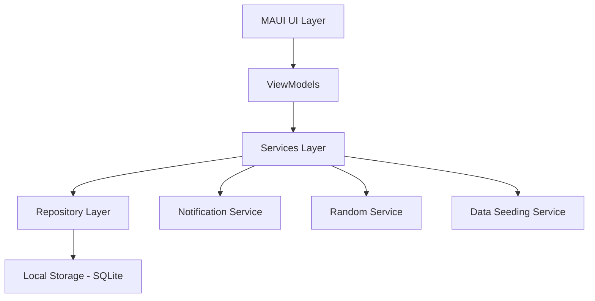

# Design Document

## Overview

WorkoutGamifier is a cross-platform mobile application built with .NET MAUI that gamifies fitness through a points-based system. The application follows an offline-only architecture with local SQLite storage, implementing MVVM pattern for clean separation of concerns and maintainable code structure.

The core gamification loop involves users earning points through completed real-life actions during workout sessions, then spending those points to receive randomized workouts from customizable pools. The application emphasizes user engagement through progress tracking, customization, and reward mechanisms.

## Architecture

### High-Level Architecture



### Architectural Patterns

- **MVVM (Model-View-ViewModel)**: Primary architectural pattern for UI separation
- **Repository Pattern**: Abstraction layer for data access operations
- **Dependency Injection**: Using Microsoft.Extensions.DependencyInjection for IoC
- **Observer Pattern**: For real-time UI updates and cross-component communication
- **Command Pattern**: For user actions and undo/redo functionality

### Technology Stack

- **Frontend**: .NET MAUI with XAML
- **Local Database**: SQLite with Entity Framework Core
- **Data Seeding**: JSON files with pre-loaded workout data
- **State Management**: CommunityToolkit.Mvvm for property binding and commands
- **Random Generation**: System.Random for workout selection
- **Local Storage**: Device file system for database and app data

## Components and Interfaces

### Core Models

```csharp
// Domain Models
public class Workout
{
    public int Id { get; set; }
    public string Name { get; set; }
    public string Description { get; set; }
    public string Instructions { get; set; }
    public int DurationMinutes { get; set; }
    public DifficultyLevel Difficulty { get; set; }
    public bool IsPreloaded { get; set; }
    public bool IsHidden { get; set; }
    public DateTime CreatedAt { get; set; }
    public DateTime UpdatedAt { get; set; }
}

public class WorkoutPool
{
    public int Id { get; set; }
    public string Name { get; set; }
    public string Description { get; set; }
    public List<Workout> Workouts { get; set; }
    public DateTime CreatedAt { get; set; }
    public DateTime UpdatedAt { get; set; }
}

public class Action
{
    public int Id { get; set; }
    public string Description { get; set; }
    public int PointValue { get; set; }
    public DateTime CreatedAt { get; set; }
    public DateTime UpdatedAt { get; set; }
}

public class Session
{
    public int Id { get; set; }
    public string Name { get; set; }
    public string Description { get; set; }
    public WorkoutPool SelectedPool { get; set; }
    public DateTime StartTime { get; set; }
    public DateTime? EndTime { get; set; }
    public int PointsEarned { get; set; }
    public int PointsSpent { get; set; }
    public List<ActionCompletion> CompletedActions { get; set; }
    public List<WorkoutReceived> ReceivedWorkouts { get; set; }
    public SessionStatus Status { get; set; }
}

public class ActionCompletion
{
    public int Id { get; set; }
    public Action Action { get; set; }
    public DateTime CompletedAt { get; set; }
    public int PointsAwarded { get; set; }
}

public class WorkoutReceived
{
    public int Id { get; set; }
    public Workout Workout { get; set; }
    public DateTime ReceivedAt { get; set; }
    public int PointsSpent { get; set; }
}
```

### Service Interfaces

```csharp
public interface IWorkoutService
{
    Task<List<Workout>> GetAllWorkoutsAsync();
    Task<Workout> CreateWorkoutAsync(Workout workout);
    Task<Workout> UpdateWorkoutAsync(Workout workout);
    Task DeleteWorkoutAsync(int workoutId);
    Task<bool> ToggleWorkoutVisibilityAsync(int workoutId);
}

public interface IWorkoutPoolService
{
    Task<List<WorkoutPool>> GetAllPoolsAsync();
    Task<WorkoutPool> CreatePoolAsync(WorkoutPool pool);
    Task<WorkoutPool> UpdatePoolAsync(WorkoutPool pool);
    Task DeletePoolAsync(int poolId);
    Task<Workout> GetRandomWorkoutFromPoolAsync(int poolId);
}

public interface ISessionService
{
    Task<Session> StartSessionAsync(string name, int workoutPoolId);
    Task<Session> GetActiveSessionAsync();
    Task<Session> EndSessionAsync(int sessionId);
    Task<List<Session>> GetSessionHistoryAsync();
    Task<ActionCompletion> CompleteActionAsync(int sessionId, int actionId);
    Task<WorkoutReceived> SpendPointsForWorkoutAsync(int sessionId, int pointCost);
}

public interface IDataSeedingService
{
    Task SeedInitialDataAsync();
    Task<bool> IsDataSeededAsync();
    Task ResetToDefaultDataAsync();
}
```

### Repository Layer

```csharp
public interface IRepository<T> where T : class
{
    Task<List<T>> GetAllAsync();
    Task<T> GetByIdAsync(int id);
    Task<T> CreateAsync(T entity);
    Task<T> UpdateAsync(T entity);
    Task DeleteAsync(int id);
}

public interface IUnitOfWork
{
    IRepository<Workout> Workouts { get; }
    IRepository<WorkoutPool> WorkoutPools { get; }
    IRepository<Action> Actions { get; }
    IRepository<Session> Sessions { get; }
    Task<int> SaveChangesAsync();
    Task BeginTransactionAsync();
    Task CommitTransactionAsync();
    Task RollbackTransactionAsync();
}
```

## Data Models

### Database Schema

```sql
-- SQLite Schema
CREATE TABLE Workouts (
    Id INTEGER PRIMARY KEY AUTOINCREMENT,
    Name TEXT NOT NULL,
    Description TEXT,
    Instructions TEXT,
    DurationMinutes INTEGER NOT NULL,
    Difficulty INTEGER NOT NULL,
    IsPreloaded BOOLEAN NOT NULL DEFAULT 0,
    IsHidden BOOLEAN NOT NULL DEFAULT 0,
    CreatedAt DATETIME NOT NULL,
    UpdatedAt DATETIME NOT NULL,
    SyncStatus INTEGER NOT NULL DEFAULT 0
);

CREATE TABLE WorkoutPools (
    Id INTEGER PRIMARY KEY AUTOINCREMENT,
    Name TEXT NOT NULL,
    Description TEXT,
    CreatedAt DATETIME NOT NULL,
    UpdatedAt DATETIME NOT NULL,
    SyncStatus INTEGER NOT NULL DEFAULT 0
);

CREATE TABLE WorkoutPoolWorkouts (
    WorkoutPoolId INTEGER,
    WorkoutId INTEGER,
    PRIMARY KEY (WorkoutPoolId, WorkoutId),
    FOREIGN KEY (WorkoutPoolId) REFERENCES WorkoutPools(Id),
    FOREIGN KEY (WorkoutId) REFERENCES Workouts(Id)
);

CREATE TABLE Actions (
    Id INTEGER PRIMARY KEY AUTOINCREMENT,
    Description TEXT NOT NULL,
    PointValue INTEGER NOT NULL,
    CreatedAt DATETIME NOT NULL,
    UpdatedAt DATETIME NOT NULL,
    SyncStatus INTEGER NOT NULL DEFAULT 0
);

CREATE TABLE Sessions (
    Id INTEGER PRIMARY KEY AUTOINCREMENT,
    Name TEXT NOT NULL,
    Description TEXT,
    WorkoutPoolId INTEGER NOT NULL,
    StartTime DATETIME NOT NULL,
    EndTime DATETIME,
    PointsEarned INTEGER NOT NULL DEFAULT 0,
    PointsSpent INTEGER NOT NULL DEFAULT 0,
    Status INTEGER NOT NULL,
    CreatedAt DATETIME NOT NULL,
    UpdatedAt DATETIME NOT NULL,
    SyncStatus INTEGER NOT NULL DEFAULT 0,
    FOREIGN KEY (WorkoutPoolId) REFERENCES WorkoutPools(Id)
);
```

### Data Storage Strategy

- **Local-Only**: All operations work entirely with local SQLite database
- **Immediate Persistence**: Changes saved immediately to local storage
- **Data Seeding**: Pre-loaded workouts included with app installation
- **Backup/Export**: Optional JSON export functionality for user data backup
- **Database Migrations**: Entity Framework migrations for schema updates

## Error Handling

### Error Categories

1. **Data Validation Errors**: Invalid input, constraint violations
2. **Storage Errors**: Database corruption, insufficient storage space
3. **Business Logic Errors**: Invalid state transitions, insufficient points
4. **Application Errors**: Unexpected crashes, memory issues
5. **User Input Errors**: Invalid operations, missing required data

### Error Handling Strategy

```csharp
public class AppException : Exception
{
    public ErrorCategory Category { get; }
    public string UserMessage { get; }
    public bool IsRetryable { get; }
    
    public AppException(ErrorCategory category, string userMessage, 
                       bool isRetryable = false, Exception innerException = null)
        : base(userMessage, innerException)
    {
        Category = category;
        UserMessage = userMessage;
        IsRetryable = isRetryable;
    }
}

public interface IErrorHandler
{
    Task HandleErrorAsync(Exception exception);
    void ShowUserError(string message, ErrorSeverity severity);
    Task<bool> PromptRetryAsync(string operation);
}
```

### User Experience for Errors

- **Graceful Degradation**: App continues working offline when sync fails
- **User Notifications**: Clear, actionable error messages
- **Retry Mechanisms**: Automatic retry for transient errors
- **Error Recovery**: Ability to recover from corrupted local data
- **Logging**: Comprehensive error logging for debugging

## Testing Strategy

### Unit Testing

- **Service Layer**: Mock repositories, test business logic
- **Repository Layer**: In-memory database for data access tests
- **ViewModels**: Mock services, test UI logic and commands
- **Utilities**: Test helper functions and extensions

### Integration Testing

- **Database Operations**: Test Entity Framework migrations and queries
- **Sync Operations**: Test cloud synchronization with test backend
- **End-to-End Workflows**: Test complete user scenarios

### UI Testing

- **MAUI UI Tests**: Automated UI testing for critical user flows
- **Manual Testing**: Device-specific testing on iOS and Android
- **Accessibility Testing**: Screen reader and accessibility compliance

### Performance Testing

- **Database Performance**: Large dataset operations
- **Memory Usage**: Memory leak detection and optimization
- **Battery Usage**: Background sync and notification impact
- **Startup Time**: App launch performance optimization

### Test Data Strategy

- **Seed Data**: Pre-loaded workouts and sample data for testing
- **Test Fixtures**: Reusable test data sets for consistent testing
- **Mock Services**: Simulated cloud services for offline testing
- **Device Testing**: Testing across different screen sizes and OS versions